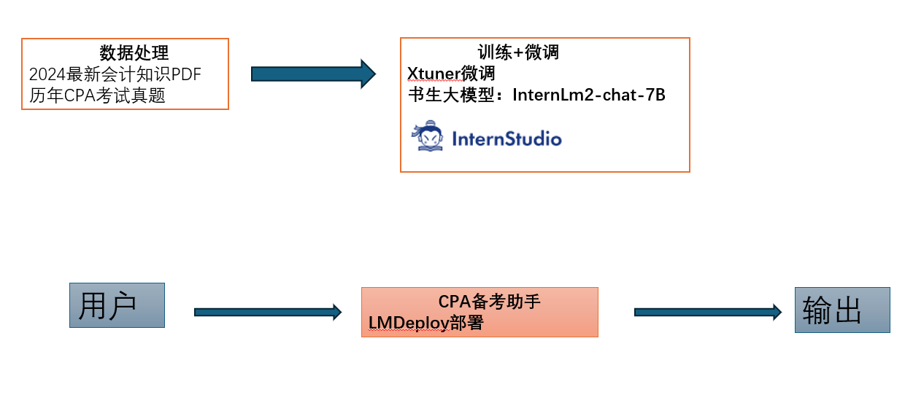

# 项目规划: CPA会计师备考助手
## 项目简介
提供CPA注册会计师专业知识，2024年最新和历年CPA考试数据。能够帮助用户，提供专业的知识。并根据知识进行模拟出题，加之有效题解。

## 提供能力
1. 支持专业的CPA知识问答
2. 支持针对知识进行出题
3. 对题目进行解析，出题解

## 架构图

拿下CPA，基于书生·浦语大模型实战营 https://github.com/InternLM/Tutorial
